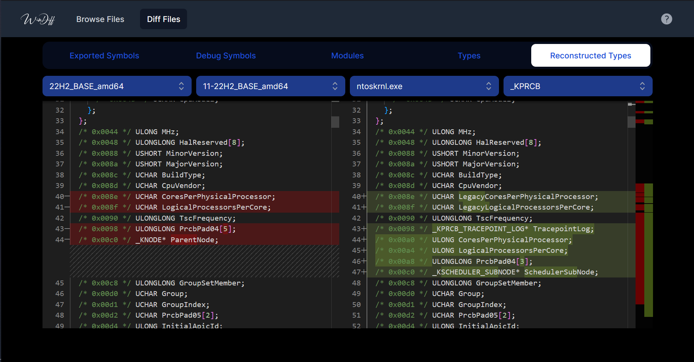

# WinDiff

## About

WinDiff is an open-source web-based tool which allows browsing and comparing symbol and type information of Microsoft Windows binaries across different versions of the operating system.

It was inspired by [ntdiff](https://github.com/ntdiff/ntdiff) and made possible
with the help of [Winbindex](https://github.com/m417z/winbindex).

## Screenshot



## How It Works

WinDiff is made of two parts: a CLI tool written in Rust and a web frontend
written in TypeScript using the Next.js framework.

The CLI tool is used to generate compressed JSON databases out of a
configuration file and relies on `Winbindex` to find and download the required
PEs (and PDBs). The idea behind the CLI tool is to be able to easily update and
regenerate databases as new versions of Windows are released. The CLI tool's
code is in the `windiff_cli` directory.

The frontend is used to visualize the data generated by the CLI tool, in a
user-friendly way. The frontend follows the same principle as `ntdiff`, as it
allows browsing information extracted from official Microsoft PEs and PDBs for
certain versions of Microsoft Windows and also allows comparing this information
between versions. The frontend's code is in the `windiff_frontend` directory.

## How to Build

### Prerequisites

- Rust 1.68 or superior
- Node.js 16.8 or superior

### Command-Line

The full build of WinDiff is "self-documented" in `ci/build_frontend.sh`, which
is the build script used to build the live version of WinDiff. Here's what's inside:

```bash
# Resolve the project's root folder
PROJECT_ROOT=$(git rev-parse --show-toplevel)

# Generate databases
cd "$PROJECT_ROOT/windiff_cli"
cargo run --release "$PROJECT_ROOT/ci/db_configuration.json" "$PROJECT_ROOT/windiff_frontend/public/"

# Build the frontend
cd "$PROJECT_ROOT/windiff_frontend"
npm ci
npm run build
```

The configuration file used to generate the data for the live version of WinDiff
is located here: `ci/db_configuration.json`, but you can customize it or use
your own.
