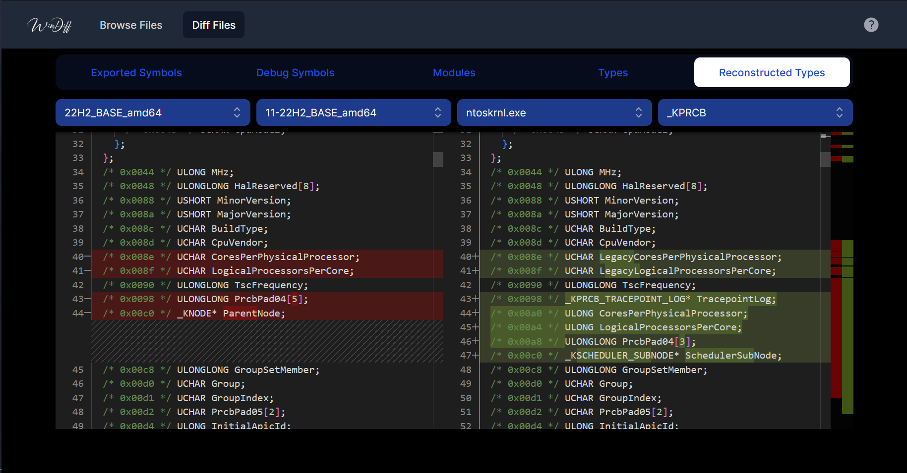

# WinDiff

## About

WinDiff is an open-source web-based tool that allows browsing and comparing
symbol, type and syscall information of Microsoft Windows binaries across
different versions of the operating system. The binary database is automatically
updated to include information from the latest Windows updates (including
Insider Preview).

It was inspired by [ntdiff](https://github.com/ntdiff/ntdiff) and made possible
with the help of [Winbindex](https://github.com/m417z/winbindex).

## Screenshot



## How It Works

WinDiff is made of two parts: a CLI tool written in Rust and a web frontend
written in TypeScript using the Next.js framework.

The CLI tool is used to generate compressed JSON databases out of a
configuration file and relies on `Winbindex` to find and download the required
PEs (and PDBs). Types are reconstructed using `resym`. The idea behind the CLI
tool is to be able to easily update and regenerate databases as new versions of
Windows are released. The CLI tool's code is in the `windiff_cli` directory.

The frontend is used to visualize the data generated by the CLI tool, in a
user-friendly way. The frontend follows the same principle as `ntdiff`, as it
allows browsing information extracted from official Microsoft PEs and PDBs for
certain versions of Microsoft Windows and also allows comparing this information
between versions. The frontend's code is in the `windiff_frontend` directory.

A scheduled GitHub action fetches new updates from `Winbindex` every day and
updates the configuration file used to generate the live version of WinDiff.
Currently, because of (free plans) storage and compute limitations, **only KB**
**and Insider Preview updates less than one year old are kept** for the live
version. You can of course rebuild a local version of WinDiff yourself, without
those limitations if you need to. See the next section for that.

Note: `Winbindex` doesn't provide unique download links for 100% of the indexed
files, so it might happen that some PEs' information are unavailable in WinDiff
because of that. However, as soon as these PEs are on VirusTotal, `Winbindex`
will be able to provide unique download links for them and they will then be
integrated into WinDiff automatically.

## How to Build

### Prerequisites

- Rust 1.85 or superior
- Node.js 20.9 or superior

### Command-Line

The full build of WinDiff is "self-documented" in `ci/build_frontend.sh`, which
is the build script used to build the live version of WinDiff. Here's what's inside:

```bash
# Resolve the project's root folder
PROJECT_ROOT=$(git rev-parse --show-toplevel)

# Generate databases
cd "$PROJECT_ROOT/windiff_cli"
cargo run --release "$PROJECT_ROOT/ci/db_configuration.json" "$PROJECT_ROOT/windiff_frontend/public/"

# Build the frontend
cd "$PROJECT_ROOT/windiff_frontend"
npm ci
npm run build
```

The configuration file used to generate the data for the live version of WinDiff
is located here: `ci/db_configuration.json`, but you can customize it or use
your own. PRs aimed at adding new binaries to track in the live configuration
are welcome.

## Security Research Skill (Claude Code)

The repository ships an [agent skill](https://docs.claude.com/en/docs/claude-code/skills)
that turns WinDiff into an automated security-research assistant. Instead of
clicking through the diff UI yourself, you can ask [Claude Code](https://claude.com/claude-code)
to compare two Windows versions and write up what changed — and *why it matters*.

The skill lives in `.claude/skills/windiff-version-diff-analysis/`. When you open
this repo in Claude Code, it loads automatically and triggers on requests like:

- "Diff `ntoskrnl.exe` between 21H2 and 24H2 and tell me what's new."
- "What new syscalls or process mitigations appeared in this Windows update?"
- "What changed in `win32k.sys` / `ci.dll` that matters for EDR or anti-cheat?"

Given two versions, the skill drives `windiff_cli` to generate the databases,
diffs them, and produces a report that interprets the raw symbol/type/syscall
delta using Windows-internals knowledge (API prefixes, component roles), framed
for three audiences: **anti-malware/EDR developers**, **anti-cheat developers**,
and **vulnerability researchers**. It highlights new syscalls, new mitigation
flags (including bits hidden inside anonymous bitfield structs, linked back to
their parent like `_EPROCESS::MitigationFlags2Values`), new ETW/threat-intel
telemetry and kernel callbacks, code-integrity changes, and brand-new components.

Here's a report generated by Claude Opus 4.7 for the prompt "Diff ntoskrnl.exe
between 25H2 and 26H1 and tell me what's new. Write your report in a markdown
file":
[ntoskrnl_25H2_to_26H1.md](./docs/claude_report_example/ntoskrnl_25H2_to_26H1.md)

### Using the diff helper without Claude Code

The skill's core diff logic is a standalone Python script with no dependencies,
usable on its own against any databases produced by `windiff_cli`:

```bash
# List the OS versions / binaries available in a database directory
python3 .claude/skills/windiff-version-diff-analysis/scripts/windiff_diff.py \
  windiff_frontend/public --list

# Diff one binary between two OS versions ("version_update_architecture" suffixes)
python3 .claude/skills/windiff-version-diff-analysis/scripts/windiff_diff.py \
  windiff_frontend/public ntoskrnl.exe 21H2_BASE_amd64 22H2_BASE_amd64
```

It prints a human-readable summary to stderr and structured JSON (added/removed
exports, symbols, modules, syscalls, and resolved type/bitfield changes) to
stdout. See the skill's `SKILL.md` for the full workflow and reference material.
